# 🛍️ Customer Behaviour Data Analysis

A complete end-to-end Data Analytics project that demonstrates the entire analytics workflow—from data cleaning in Python, database management in MySQL, SQL analysis, and finally building an interactive Power BI dashboard.

---

# 📌 Project Overview

The objective of this project was to analyze customer purchasing behaviour and identify meaningful business insights that can support data-driven decision making.

The project follows a real-world analytics pipeline:

Raw Dataset → Python Data Cleaning → MySQL Database → SQL Analysis → Power BI Dashboard

---

# 🛠️ Tools & Technologies

- Python
- Pandas
- Jupyter Notebook
- MySQL Workbench
- SQL
- Power BI

---

# 📂 Project Workflow

## 1. Data Cleaning (Python)

The dataset was cleaned using Pandas by:

- Handling missing values
- Removing duplicates
- Standardizing categorical values
- Correcting data types
- Preparing the dataset for SQL analysis

### Python Screenshots

| Step | Screenshot |
|------|------------|
| Data Cleaning | 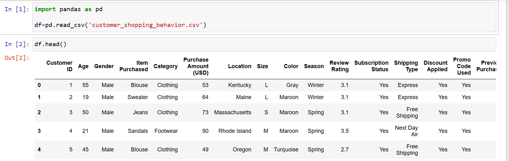 |
| Missing Value Handling | 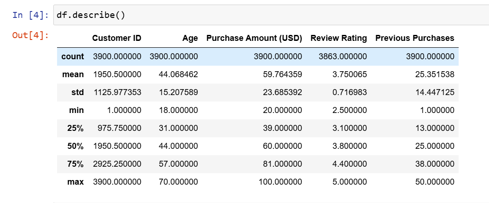 |
| Data Transformation | 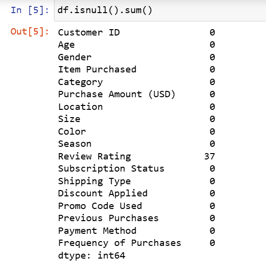 |
| Cleaning Process | 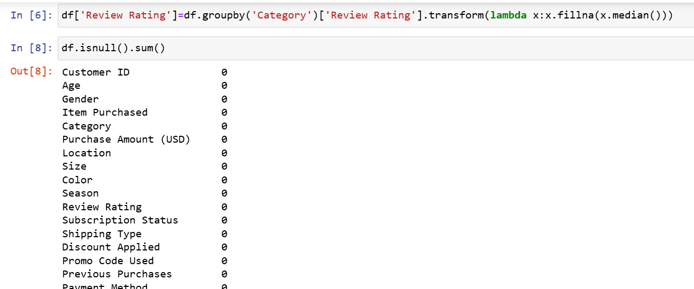 |
| Feature Engineering | 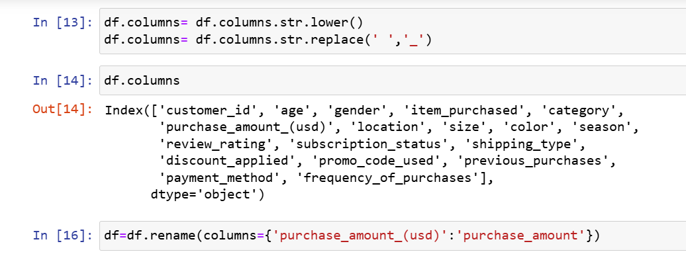 |
| Data Validation | 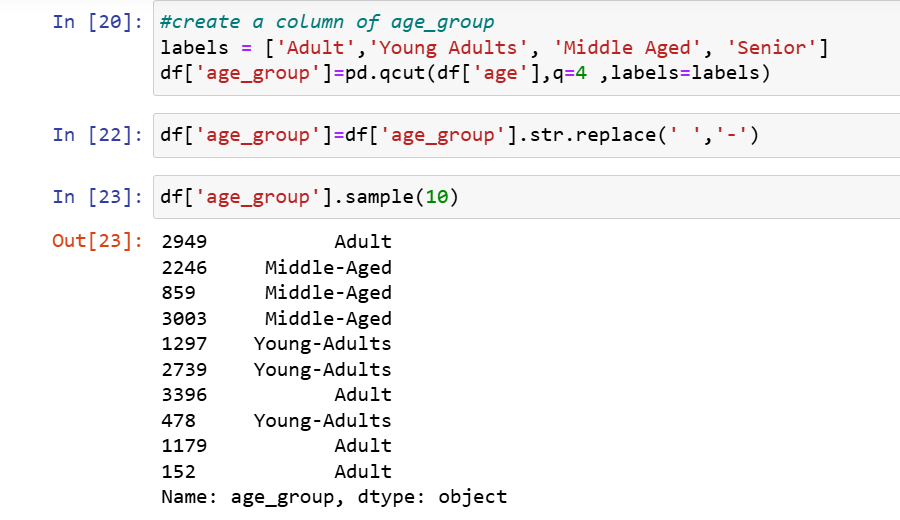 |
| Final Dataset | 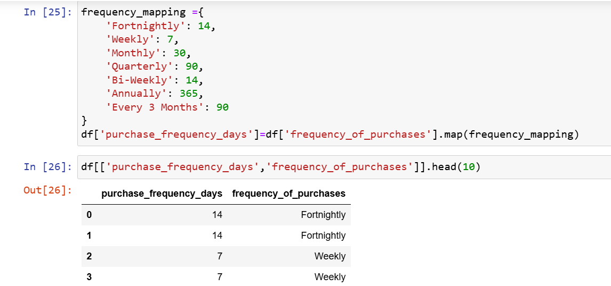 |
| Export Cleaned CSV | 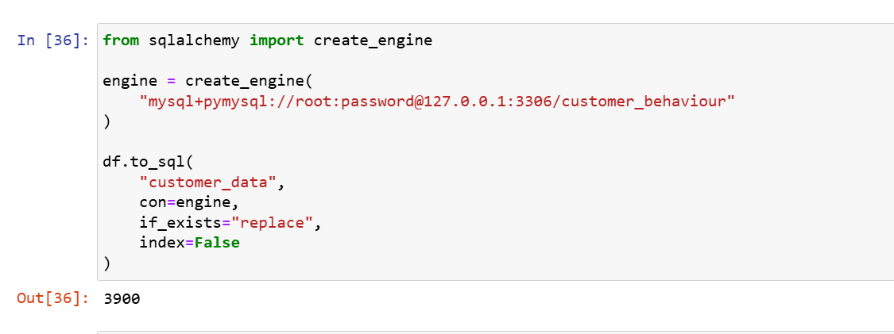 |

---

## 2. Database Creation (MySQL)

The cleaned CSV was imported into MySQL Workbench for further analysis.

---

## 3. SQL Analysis

The following business questions were answered using SQL.

### Revenue by Gender

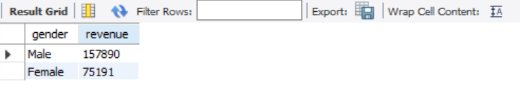

---

### Customers Receiving Discounts with Above Average Purchases

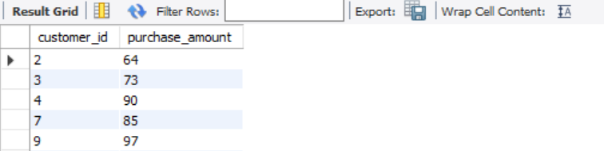

---

### Top Rated Products

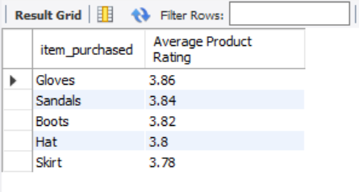

---

### Average Purchase Amount by Shipping Type

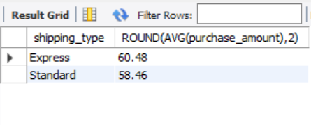

---

### Subscription Analysis

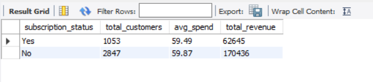

---

### Discount Rate by Product

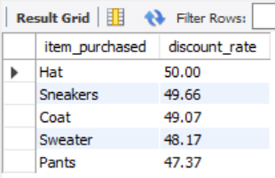

---

### Customer Segmentation

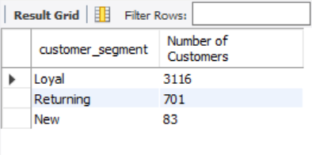

---

### Top Selling Products by Category

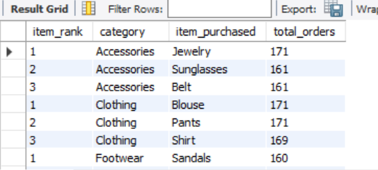

---

### Repeat Buyers

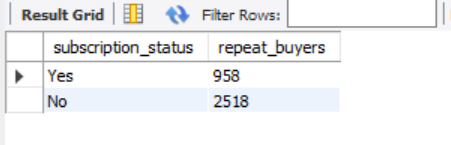

---

### Revenue Contribution by Age Group

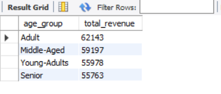

---

# 📊 Power BI Dashboard

The final dashboard provides an interactive overview of customer behaviour.

Features include:

- KPI Cards
- Revenue Analysis
- Customer Distribution
- Sales by Category
- Revenue by Age Group
- Sales by Age Group
- Interactive Filters
- Subscription Analysis

## Dashboard Preview

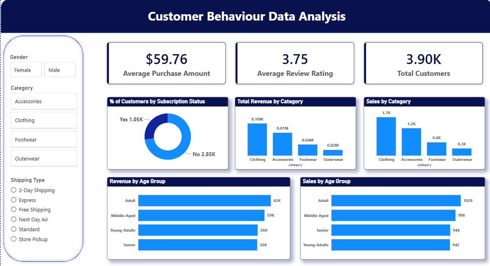

---

# 📈 Key Insights

- Clothing generated the highest revenue.
- Adults contributed the highest total revenue.
- Average Purchase Amount: **$59.76**
- Average Review Rating: **3.75**
- Total Customers: **3,900**
- Most customers were non-subscribers.
- Customer purchasing behaviour varied significantly across categories.

---

# 📁 Repository Structure

```text
Customer-Behaviour-Data-Analysis/
│
├── Customer_Behaviour_Analysis.pbix
├── customer_data.csv
├── Customer_Behaviour_Project_Documentation.docx
├── README.md
└── Project_4_Screenshots/
    ├── power_bi.png
    ├── py1.png
    ├── ...
    ├── py8.png
    ├── sql1.png
    ├── ...
    └── sql10.png
```

---

# 🚀 Skills Demonstrated

- Data Cleaning
- Data Wrangling
- Python Programming
- SQL Query Writing
- MySQL Database Management
- Business Analysis
- Data Visualization
- Dashboard Development
- Power BI

---

# 👨‍💻 Author

**Syed Sami Ullah**

- GitHub: https://github.com/SyedSamiUllah1
- LinkedIn: www.linkedin.com/in/syed-sami-ullah-9232602a6

---
